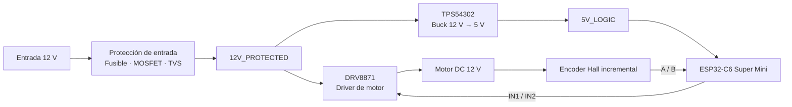

# DC Motor Controller with Encoder — REV A

**Electrónica de potencia · Control de motores · Hardware embebido · Diseño PCB**

[English](README.md) · [Decisiones de diseño](docs/design-decisions.md) · [Plan de bring-up](docs/bring-up-plan.md) · [Arquitectura de firmware](firmware/README.md)

Controlador de **motor DC de 12 V con encoder incremental** diseñado en **EasyEDA Pro**, con etapas de potencia desarrolladas a nivel de componente y un **ESP32-C6 Super Mini removible** como controlador.

REV A se desarrolló para avanzar más allá de la integración de módulos comerciales listos para conectar. La PCB integra protección de entrada, un buck 12 V → 5 V basado en TPS54302, driver DRV8871, acondicionamiento del encoder y la interfaz con el MCU en una tarjeta propia de dos capas.

> **REV A** corresponde a la primera revisión de hardware. El esquemático, routing, DRC y revisión 3D están completos. La fabricación del prototipo y el bring-up físico son la siguiente fase.

## Alcance de ingeniería

- Entrada de 12 V protegida mediante fusible, MOSFET P-channel contra polaridad inversa y TVS.
- Buck 12 V → 5 V basado en TPS54302 y diseñado con sus componentes externos.
- Driver DRV8871 con red de limitación de corriente, desacoplo, capacitor bulk y diseño térmico del exposed pad.
- Interfaz para encoder Hall incremental A/B compatible con lógica de 3.3 V.
- ESP32-C6 Super Mini removible mediante headers para programación, depuración y sustitución.
- PCB de dos capas con zonificación funcional, routing diferenciado de potencia/señal, planos GND, stitching vias y thermal vias.
- DRC limpio y revisión 3D en EasyEDA Pro.

## Arquitectura del sistema



## Integración del sistema — Fusion 360

Se utiliza un ensamble independiente en **Fusion 360** para revisar el controlador dentro del sistema, representando físicamente el motor DC de referencia y el módulo ESP32-C6 removible. Esta vista complementa el modelo 3D de EasyEDA al mostrar la relación entre la PCB y el hardware que la rodea.

El ensamble sirve como referencia de integración para acceso a conectores, orientación del módulo y empaquetado general antes de fabricar el prototipo. No se presenta como validación de ajuste físico definitivo hasta ensamblar y comprobar la PCB fabricada.

## Arquitectura de hardware

| Función | Implementación |
|---|---|
| Entrada | 12 V DC nominal |
| Protección | Fusible slow-blow 3 A, MOSFET P-channel contra polaridad inversa y TVS SMBJ15A |
| Driver de motor | Texas Instruments DRV8871DDAR |
| Limitación de corriente | Red ILIM externa |
| Alimentación lógica | Buck Texas Instruments TPS54302DDCR |
| MCU | ESP32-C6 Super Mini removible |
| Encoder | Interfaz Hall incremental A/B a 3.3 V |
| PCB | 2 capas · FR-4 · 1.6 mm · cobre 1 oz |

## Entrada y protección

La alimentación de 12 V atraviesa la etapa de protección antes de alimentar el resto de la placa:

```text
ENTRADA 12 V → FUSIBLE → MOSFET DE POLARIDAD INVERSA → 12V_PROTECTED
                                                       │
                                                       └── TVS → GND
```

La entrada está orientada a una fuente DC regulada de 12 V; no se presenta como una etapa automotive/load-dump certificada.

## Buck 12 V → 5 V

La alimentación lógica se genera mediante un **TPS54302** y sus componentes externos, en lugar de utilizar un módulo DC/DC comercial.

La etapa incorpora capacitores de entrada y salida, capacitor bootstrap, inductor blindado, red de feedback y divisor de enable/UVLO. La salida **5V_LOGIC** alimenta la electrónica de la tarjeta y la interfaz removible del ESP32-C6.

## Driver de motor

El **DRV8871** controla ambos terminales del motor mediante su puente H para permitir inversión electrónica del sentido.

La etapa incluye desacoplo local, capacitor bulk, programación externa de limitación de corriente, rutas de potencia cortas y un PowerPAD conectado a GND mediante cuatro thermal vias en patrón 2 × 2.

La capacidad térmica y el comportamiento de corriente serán medidos durante el bring-up físico.

## Encoder y MCU

El encoder Hall incremental proporciona canales A/B. REV A lo alimenta a **3.3 V** y acondiciona ambas señales antes de llevarlas al ESP32.

El ESP32-C6 Super Mini es removible y recibe 5V_LOGIC, controla las entradas del driver y adquiere los canales del encoder. El USB-C queda orientado para programación y depuración.

## Ingeniería PCB

La placa se dividió en cuatro zonas funcionales:

**12V POWER · BUCK CONVERTER · DRIVER MOTOR · MCU ENCODER**

Se utilizaron anchos de pista distintos para señales, alimentación lógica y rutas de potencia. Los planos de GND ocupan Top y Bottom, unidos mediante stitching vias. El exposed pad del DRV8871 utiliza thermal vias dedicadas hacia el plano inferior.

Los conectores externos se mantuvieron principalmente en los bordes para facilitar cableado y pruebas de banco.

## Verificación del diseño

| Revisión | Estado |
|---|---|
| Esquemático | Completo |
| DRC de esquemático | Aprobado |
| Placement y routing | Completo |
| DRC de PCB | Aprobado |
| Planos GND | Completos |
| Stitching vias | Completas |
| Thermal vias DRV8871 | Completas |
| Revisión 3D | Completa |
| Fabricación | Siguiente fase |
| Bring-up eléctrico | Siguiente fase |
| Pruebas motor / encoder | Siguiente fase |
| Control en lazo cerrado | Fase futura |

## Bring-up planificado

La primera tarjeta se verificará de forma incremental: inspección visual, continuidad, búsqueda de cortos, encendido con fuente limitada en corriente, comprobación de rails, prueba del MCU, adquisición del encoder, prueba del driver sin carga, motor, sentido, PWM, RPM, carga y temperaturas.

Consulta el [plan completo de bring-up](docs/bring-up-plan.md).

## Futuras revisiones

Los cambios de REV B se definirán a partir de mediciones reales de REV A. Se contemplan reducción de tamaño, test points, patrón mecánico de montaje, refinamiento de conectores, integración del área de antena, mejoras de protección y posibles interfaces industriales si el alcance evoluciona.

## Estado

**REV A · Diseño completo · DRC aprobado · Revisión 3D completa**

Actualmente el proyecto pasa de la etapa de diseño PCB a fabricación del prototipo y bring-up estructurado. No se publican todavía resultados físicos que no hayan sido medidos.

## Autor

**Luis Alejandro Pérez Sousa**  
Ingeniería Mecatrónica · Sistemas embebidos · Diseño PCB · Integración hardware/firmware
