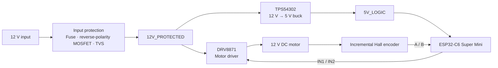

# DC Motor Controller with Encoder — REV A

**Power Electronics · Motor Control · Embedded Hardware · PCB Design**

[Español](README.es.md) · [Design decisions](docs/design-decisions.md) · [Bring-up plan](docs/bring-up-plan.md) · [Firmware architecture](firmware/README.md)

A component-level **12 V DC motor controller** designed in **EasyEDA Pro** for a geared DC motor with an incremental Hall encoder and a removable **ESP32-C6 Super Mini** controller.

REV A was developed to move beyond module-based prototyping and design the main power and motor-control stages from individual ICs and supporting components. The board integrates input protection, a custom 12 V → 5 V buck stage, a DRV8871 H-bridge motor driver, encoder signal conditioning and the MCU interface on a two-layer PCB.

> **REV A** is the first hardware revision. Schematic capture, PCB routing, DRC and 3D review are complete. Prototype fabrication and hardware bring-up are the next phase.

## Engineering scope

- 12 V protected power input with fuse, reverse-polarity P-channel MOSFET and TVS protection.
- TPS54302-based 12 V → 5 V buck converter designed from the regulator IC and external passives.
- DRV8871 motor driver with current-limit network, local decoupling, bulk capacitance and exposed-pad thermal design.
- Incremental Hall encoder A/B interface with 3.3 V logic compatibility, series resistors and pull-ups.
- Removable ESP32-C6 Super Mini on headers for programming, debugging and replacement.
- Two-layer PCB with functional zoning, differentiated power/signal routing, GND pours, stitching vias and thermal vias.
- DRC-clean design and 3D board review in EasyEDA Pro.

## System architecture



The board separates the high-current motor path, switching regulator, input protection and MCU/encoder interface into distinct functional areas to keep routing understandable and bring-up friendly.

## Hardware architecture

| Function | Implementation |
|---|---|
| Input | 12 V nominal DC |
| Input protection | 3 A slow-blow fuse, P-channel MOSFET reverse-polarity protection, SMBJ15A TVS |
| Motor driver | Texas Instruments DRV8871DDAR |
| Current-limit network | External ILIM resistor network |
| Logic supply | Texas Instruments TPS54302DDCR buck regulator |
| MCU | Removable ESP32-C6 Super Mini |
| Encoder | Incremental Hall A/B interface at 3.3 V logic |
| PCB | 2 layers · FR-4 · 1.6 mm · 1 oz copper |

## Power input and protection

The 12 V input passes through three protection elements before reaching the main protected rail:

```text
12 V INPUT → FUSE → REVERSE-POLARITY MOSFET → 12V_PROTECTED
                                             │
                                             └── TVS → GND
```

The protection stage was designed for a regulated 12 V DC source. It is not presented as an automotive load-dump-qualified input stage.

## 12 V → 5 V buck converter

The logic rail is generated with a **TPS54302** synchronous buck regulator rather than a pre-built DC/DC module.

The design includes the regulator IC, input/output ceramic capacitors, bootstrap capacitor, shielded inductor, feedback network and enable/UVLO divider. The resulting **5V_LOGIC** rail powers the onboard logic and removable ESP32-C6 interface.

This stage was laid out as a compact switching-power section, keeping the high-current switching path local and separated from the encoder/MCU area.

## Motor driver

Motor power is handled by the **DRV8871**, with both motor terminals driven by the H-bridge outputs so direction can be reversed electronically.

The driver section includes:

- local high-frequency decoupling;
- bulk capacitance near the motor supply;
- external current-limit programming;
- short high-current paths to the motor connector;
- an exposed PowerPAD connected to GND;
- four GND thermal vias in a 2 × 2 pattern below the exposed pad.

The current-limit network establishes the intended regulation threshold for REV A, but continuous current capability will be evaluated during physical bring-up together with device temperature.

## Encoder and MCU interface

The reference motor uses a two-channel incremental Hall encoder. REV A powers the encoder from the ESP32's **3.3 V rail** and routes channels A/B through simple input-conditioning networks before reaching the MCU.

The removable ESP32-C6 Super Mini provides:

- motor control outputs to the DRV8871;
- encoder A/B inputs;
- 5 V power input from the local buck stage;
- USB-C access for programming/debugging.

Unused MCU pins remain intentionally uncommitted in this revision.

## PCB engineering

The layout was intentionally divided into four functional zones:

**12V POWER · BUCK CONVERTER · DRIVER MOTOR · MCU ENCODER**

Power and signal tracks use different widths according to their expected role. Local neck-down is used only where small IC pads require it before transitioning into wider power routing.

Both Top and Bottom layers include GND copper pours. GND stitching vias connect the planes across the board, while dedicated thermal vias under the DRV8871 PowerPAD provide an electrical and thermal path to the lower GND plane.

External connectors are positioned near board edges to simplify wiring and bench access.

## Design verification

REV A has completed the design-stage checks currently available in EasyEDA Pro:

| Check | Status |
|---|---|
| Schematic capture | Complete |
| Schematic DRC | Passed |
| PCB placement and routing | Complete |
| PCB DRC | Passed |
| Top / bottom GND pours | Complete |
| GND stitching vias | Complete |
| DRV8871 thermal vias | Complete |
| 3D board review | Complete |
| Prototype fabrication | Next phase |
| Electrical bring-up | Next phase |
| Motor / encoder testing | Next phase |
| Closed-loop control | Future phase |

## Planned bring-up

The first fabricated board will be commissioned incrementally rather than connecting the full system at once. The planned sequence covers visual inspection, continuity/short checks, current-limited power-up, verification of protected 12 V and 5 V rails, MCU power-up, encoder acquisition, unloaded driver checks, motor direction/PWM testing, RPM measurement, load testing and thermal inspection.

See the full [planned bring-up procedure](docs/bring-up-plan.md).

## Design decisions and constraints

REV A prioritizes an understandable, serviceable and measurable first hardware revision over maximum miniaturization. Component selection, current paths, grounding, thermal behavior and manufacturability were considered before routing.

The detailed rationale is documented in [design decisions](docs/design-decisions.md).

## Future revisions

Physical measurements from REV A will determine the next changes. Potential REV B work includes:

- board-size reduction based on real assembly constraints;
- dedicated test points;
- defined mounting-hole pattern;
- improved mechanical integration for the ESP32 module and antenna region;
- connector refinement;
- additional protection on external signals;
- layout changes informed by thermal and EMI observations;
- optional industrial interfaces only if the project scope expands.

## Repository structure

```text
README.md
README.es.md

docs/
├── design-decisions.md
├── bring-up-plan.md
└── images/                 PCB, schematic and 3D portfolio images

firmware/
└── README.md               Planned firmware architecture

hardware/
└── README.md               REV A hardware summary / future design exports
```

## Project status

**REV A · Design complete · DRC passed · 3D review complete**

The project is currently transitioning from PCB design to prototype fabrication and structured hardware bring-up. No fabricated-board measurements, motor-control performance or closed-loop results are claimed yet.

## Author

**Luis Alejandro Pérez Sousa**  
Mechatronics Engineering · Embedded Systems · PCB Design · Hardware/Firmware Integration
