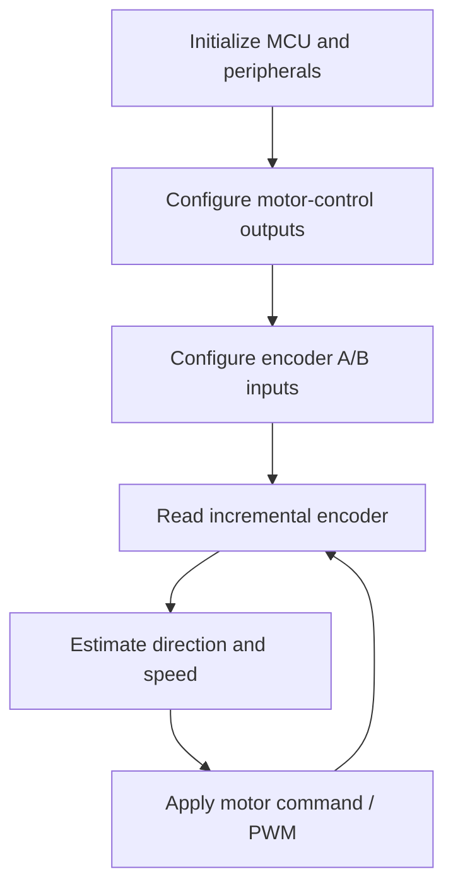

# Firmware Architecture

Firmware is not yet published for REV A because the current project milestone is the completed hardware design.

The planned firmware responsibilities are:

Future firmware work may include:

- PWM generation;
- direction control;
- quadrature A/B acquisition;
- RPM calculation;
- speed control;
- closed-loop tuning;
- optional position-control experiments.

No closed-loop performance is claimed until it is implemented and tested with physical hardware.
